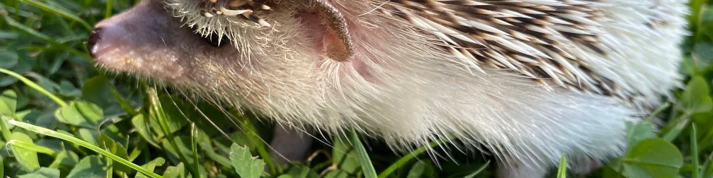

# Melanie Koeppen - Product Person

I am a freelance Product Person - I am available for short-term or long-term product projects or as an interim or fractional product manager or product leader. 

- I bridge your Product Management or Product Leadership needs until you can hire someone full-time, or if you don’t want to hire full-time just yet.
- I help you scale up quickly, or cover long-term absence. 
- I help you level-up your product team.

---

# ✉️ Get in touch

📧 Email - melaniekoeppen@me.com

🖇️ LinkedIn - [https://www.linkedin.com/in/melaniek-/](https://www.linkedin.com/in/melaniek-/)

---

# The services I offer

## 🧩 Product Management

> **I build products along the entire product life cycle.**

Having worked in Product for over 14 years, I have experience in shipping products from the ground up, experimenting early and often, scaling, finding the right product/market fit, as well as sunsetting products. My portfolio includes working on

- social platforms
- e-commerce and marketplaces
- insurtech
- B2B platforms
- Open Source technology and products

My expertise lies in setting up products from 0 --> 1, meaning finding the first solution to a problem in order to understand first customer feedback in order to set out the direction for the product. I am a core believer in open and transparent communication, and bringing the experts to the table in order to find the best solution for a product problem.

I have a knack for lean product development methodologies, and can easily do Scrum, Kanban, or your own ways of working.

## 🚀 Product Leadership

> **I set up product processes and best practices, and I coach and mentor Product Managers on their journey.**

I approach product leadership with a people-first mentality. The job of a product leader is to enable product managers, product designers and everyone else to be successful at what they do best. I find it important to nurture autonomy, agency and a clear understanding of expectations. I am trying to be a role model in transparent communication, and clear vision- and goal-setting.

I have established product processes before, getting product, engineering and design teams onto a successful path of continuous product shipping with room for exploration, discovery and delivery while being able to manage business expectations and creating some predictability.

I have set product vision and product goals to set the frame for team-specific product strategies and roadmaps that align with the overall company direction. I help create the product strategy that aligns with your business goals and connects product to the overall success of the business. My passion is to ensure that product strategy is well connected in the overall business goals, and product success can be measured by the impact on business. I help digging out assumptions that need to be made explicit as well as help setting up product measurements, processes etc to connect product strategy to company planning and goal setting.

# My Experience

## Executive Summary

- set up and implemented organisation-wide product development processes with buy-in from all teams resulting in consistent product delivery
- led cross-functional strategic products from inception to GTM that span the entire company resulting in increased ad revenue
- owned P&L for product driven KPIs and set product strategy accordingly
- was in charge of multiple teams directly and indirectly at the same time
- hired and developed team members across multiple disciplines - including budgeting for salary, promotions, new roles, as well as supporting career changes
- negotiated contracts with external parties and services to provide value to the company through reduced compliance risk and increased content revenue streams
- led external and internal stakeholder communication, incl QBRs, business alignment and relationship building

## Selection of previous roles

- Director of Product @SoundCloud Ltd
- Director of Product @IDAGIO
- Head of Product @Wikimedia e.V.
- Lead Product Manager @wefox Group

---

# ✉️ Get in touch

📧 Email - melaniekoeppen@me.com

🖇️ LinkedIn - [https://www.linkedin.com/in/melaniek-/](https://www.linkedin.com/in/melaniek-/)
